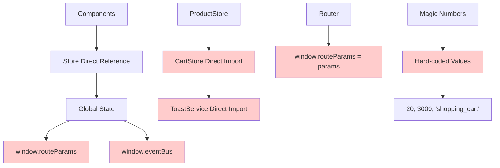
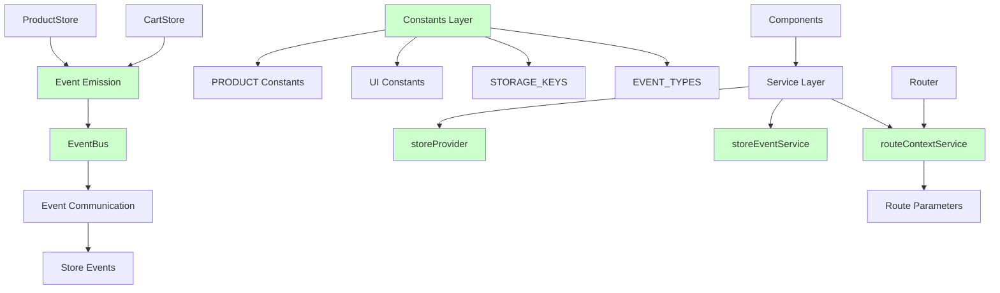
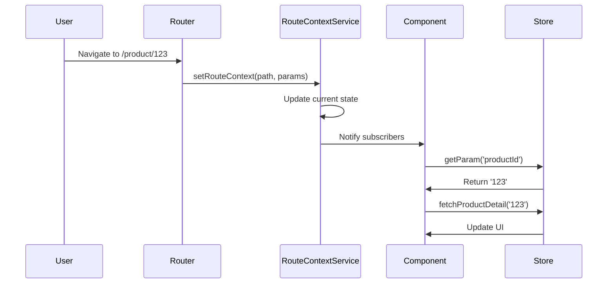
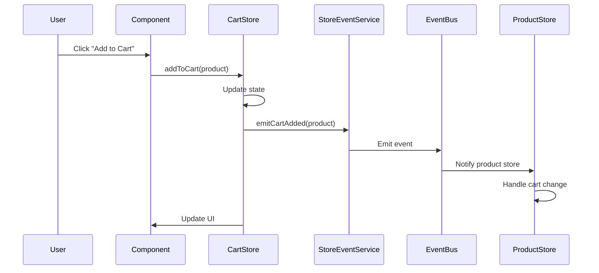
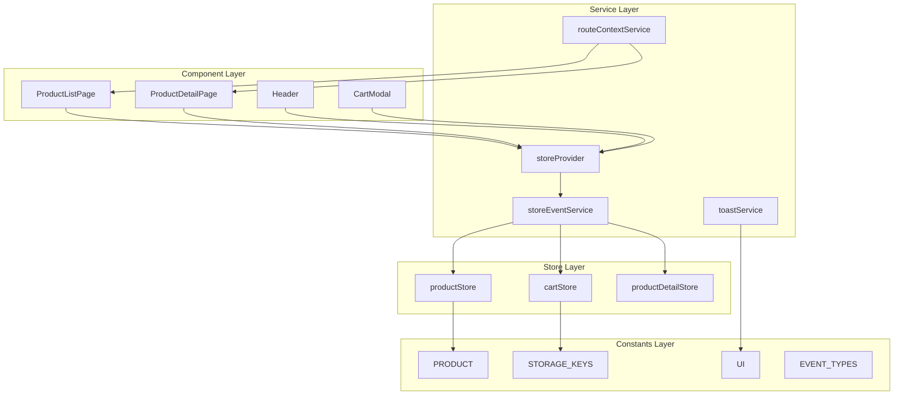

# 아키텍처 다이어그램

## 📊 리팩토링 전후 아키텍처 비교

### Before: 직접 참조 구조 (문제점)



**문제점**:

- 🔴 전역 상태 오염
- 🔴 Store 간 강결합
- 🔴 매직 넘버 사용
- 🔴 예측 불가능한 상태 변경

### After: 이벤트 기반 구조 (개선)



**개선점**:

- 🟢 서비스 기반 상태 관리
- 🟢 이벤트 기반 통신
- 🟢 중앙화된 상수 관리
- 🟢 예측 가능한 상태 변경

---

## 🔄 데이터 플로우 다이어그램

### 라우트 변경 플로우



### 장바구니 추가 플로우



---

## 🏗️ 서비스 레이어 구조



---

## 📋 이벤트 타입 매트릭스

| 이벤트 타입             | 발행자        | 구독자              | 목적                 |
| ----------------------- | ------------- | ------------------- | -------------------- |
| `cart:added`            | CartStore     | StoreEventService   | 장바구니 추가 알림   |
| `cart:removed`          | CartStore     | StoreEventService   | 장바구니 제거 알림   |
| `cart:cleared`          | CartStore     | StoreEventService   | 장바구니 비우기 알림 |
| `product:filterChanged` | ProductStore  | StoreEventService   | 필터 변경 알림       |
| `product:loaded`        | ProductStore  | StoreEventService   | 상품 로드 완료 알림  |
| `route:changed`         | Router        | RouteContextService | 라우트 변경 알림     |
| `cart:requestCount`     | StoreProvider | CartStore           | 장바구니 카운트 요청 |
| `product:requestState`  | StoreProvider | ProductStore        | 상품 상태 요청       |

---

## 🔧 상수 구조도

```mermaid
graph TD
    A[constants/index.js] --> B[PRODUCT]
    A --> C[UI]
    A --> D[STORAGE_KEYS]
    A --> E[EVENT_TYPES]
    A --> F[ROUTES]

    B --> B1[DEFAULT_LIMIT: 20]
    B --> B2[MAX_LIMIT: 100]
    B --> B3[DEFAULT_SORT: "price_asc"]
    B --> B4[DEFAULT_PAGE: 1]

    C --> C1[TOAST_AUTO_REMOVE_DELAY_MS: 3000]
    C --> C2[ANIMATION_DURATION_MS: 300]

    D --> D1[CART: "shopping_cart"]

    E --> E1[CART_ADDED: "cart:added"]
    E --> E2[CART_REMOVED: "cart:removed"]
    E --> E3[CART_CLEARED: "cart:cleared"]
    E --> E4[PRODUCT_FILTER_CHANGED: "product:filterChanged"]
    E --> E5[PRODUCT_LOADED: "product:loaded"]
    E --> E6[ROUTE_CHANGED: "route:changed"]

    F --> F1[HOME: "/"]
    F --> F2[PRODUCT_DETAIL: "/product/:productId"]
    F --> F3[NOT_FOUND: "/non-existent-page"]
```

---

## 🎯 마이그레이션 매핑

### 전역 상태 → 서비스 매핑

| Before (전역 상태)   | After (서비스)           | 사용법                                           |
| -------------------- | ------------------------ | ------------------------------------------------ |
| `window.routeParams` | `routeContextService`    | `routeContextService.getParam('productId')`      |
| `window.eventBus`    | `eventBus` (의존성 주입) | `import { eventBus } from './utils/EventBus.js'` |

### Store 참조 → 이벤트 매핑

| Before (직접 참조)             | After (이벤트)                                 | 사용법                                                |
| ------------------------------ | ---------------------------------------------- | ----------------------------------------------------- |
| `cartStore.addToCart()`        | `storeEventService.emitCartAdded()`            | `storeEventService.emitCartAdded(product)`            |
| `productStore.updateFilters()` | `storeEventService.emitProductFilterChanged()` | `storeEventService.emitProductFilterChanged(filters)` |

### 매직 넘버 → 상수 매핑

| Before (매직 넘버)      | After (상수)                    | 사용법                                           |
| ----------------------- | ------------------------------- | ------------------------------------------------ |
| `limit: 20`             | `PRODUCT.DEFAULT_LIMIT`         | `limit: PRODUCT.DEFAULT_LIMIT`                   |
| `setTimeout(..., 3000)` | `UI.TOAST_AUTO_REMOVE_DELAY_MS` | `setTimeout(..., UI.TOAST_AUTO_REMOVE_DELAY_MS)` |
| `"shopping_cart"`       | `STORAGE_KEYS.CART`             | `STORAGE_KEYS.CART`                              |

---

**문서 작성자**: 389팀 Common AI Development Assistant  
**최종 업데이트**: 2024년 12월 19일
